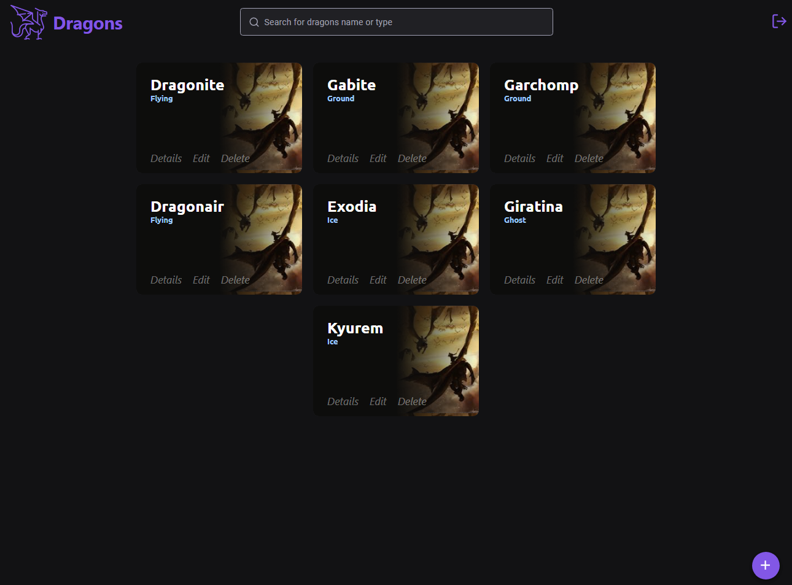

Live Demo: https://dragons-nine.vercel.app



## 💻 About

### :desktop_computer: Run web (Front End)

```bash
git clone
cd Dragons
npm install
npm start
```
Usuário para login, caso não deseje criar um novo :
- Usuário: admin
- Senha: admin
  
Executar os teste unitários do app:
- npm test

## 🛠 Technology
- 🔵 TypeScript
- ⚛️ Reactjs
- Redux

<b>Funcionalidades:</b>
Login
- Tela inicial deve ser o login
- Não deve ser possível acessar outras telas sem realizar o login
- Exibir uma lista com todos os dragons cadastrados, com opção para pesquisa
- Exibir mais detalhes do dragon

CRUD de dragons
- Criar cadastro, edição e remoção de dragons

Fake Mock API Endpoints:
- https://5fbcdf9f3f8f90001638c61a.mockapi.io/dragons


